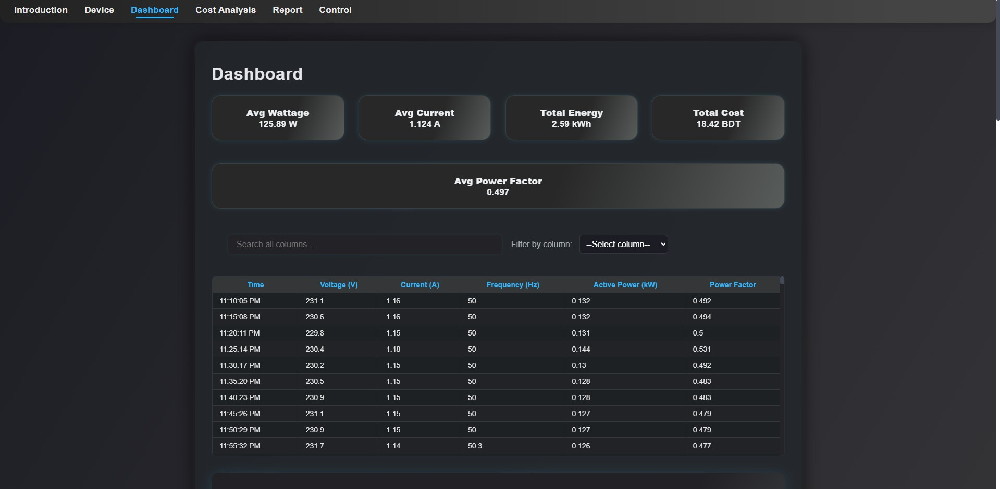

# IoT Energy Monitoring Dashboard

> **Monitor, analyze, and visualize real appliance energy data — live in your browser.**
>
> *Khalid Mahmud Joy · ID: 2022-3-60-159 · Green Computing (CSE407), East West University*
# **Live project:**  
# (https://joy5691.github.io/IoT_Device_Dashboard/))

## 🚀 Introduction

This dashboard is a real project demonstrating **IoT-based real-time and historical energy monitoring** for a household refrigerator. 
It uses a TOMZN 63A WiFi Smart Switch (Tuya platform) to collect genuine data every five minutes, processed and displayed with a modern, interactive website.

- **Compare energy, power factor, cost and more — with pro-style animated KPI cards and charts.**
- **Browse, search and filter your raw data right in the browser.**
- **Read the project report, see the device setup, and demo remote controls.**
- _Perfect as a capstone for green computing or IoT engineering courses!_

---

## 🌟 Features

- **Live Data Dashboard:**  
  - Pro-style KPI cards (Energy, Cost, Peak Power, Power Factor)
  - Animated gauges for average wattage/current
  - Power factor analysis with rating badge and tip
  - Beautiful line charts: Voltage/Current/Power/Frequency over time
  - Scatter plots for device analytics
  - Searchable, filterable data table

- **Cost Analysis:**
  - Per-day total energy and cost
  - Chart comparing each day (bars for kWh and BDT)

- **Device Details:**  
  - IoT device and appliance images + setup summary

- **Controls:**  
  - Demo on/off button (UI only)

- **Project Report:**  
  - Attractive, formatted executive summary with workflow, costs, PESTLE/SWOT, and main findings

- **Fully responsive and dark/silver-black modern look, inspired by the best SaaS dashboards**

---

## 📸 Demo

  


---

## 🗂️ Table of Contents

- [Introduction](#introduction)
- [Features](#features)
- [Demo](#demo)
- [File & Folder Structure](#file--folder-structure)
- [Quick Start & Usage](#quick-start--usage)
- [Pages](#pages)
- [Credits](#credits)
- [License](#license)

---

## 🏗️ File & Folder Structure

/
├── index.html # Introduction
├── device.html # Device and appliance details
├── dashboard.html # Data KPIs, table, search, charts, gauges
├── cost-analysis.html # Per-day cost breakdown and graphs
├── report.html # Project overview, summary, workflow, results
├── controls.html # Demo control buttons
├── style.css # Site-wide beautiful theme and layout
├── data.csv # Raw CSV data, 5-min interval over 2+ days
└── assets/
├── iot.png
└── ref.jpg

---

## 🚦 Quick Start & Usage

1. **Open online:**  
   Visit `https://yourusername.github.io/dashboard.html` (replace `yourusername` with your actual GitHub).
2. **Or run locally:**  
   - Download/extract all files to a folder.
   - Start a simple server (Python):
     ```
     python -m http.server 8000
     ```
   - Open `http://localhost:8000/dashboard.html` in your browser.

**All features run in your browser.**  
If you want to use *your own* appliance CSV, just replace `data.csv`.

---

## 📖 Pages

| Page                | What You’ll Find                                            |
|---------------------|------------------------------------------------------------|
| `index.html`        | Introduction, summary, and project overview                |
| `device.html`       | IoT/Appliance images and description                       |
| `dashboard.html`    | Live animated KPIs/gauges, charts, search/filterable table |
| `cost-analysis.html`| Per-day total energy/cost data & charts                    |
| `report.html`       | Executive summary, workflow, results, SWOT/PESTLE, conclusion  |
| `controls.html`     | Demo on/off control UI                                     |


---

## 👤 Credits

- **Author:**  
  Khalid Mahmud Joy  
  Student ID: 2022-3-60-159

- **Instructor:**  
  EWU, Green Computing, CSE407

### ✨ Open Source Libraries

- [Responsive CSS design](https://github.com/joy5691)

---

## 💡 Learn More or Contribute

Got an idea? Improved data or control?  
Open a GitHub issue or pull request!

**Live project:**  
(https://joy5691.github.io/IoT_Device_Dashboard/))

---


